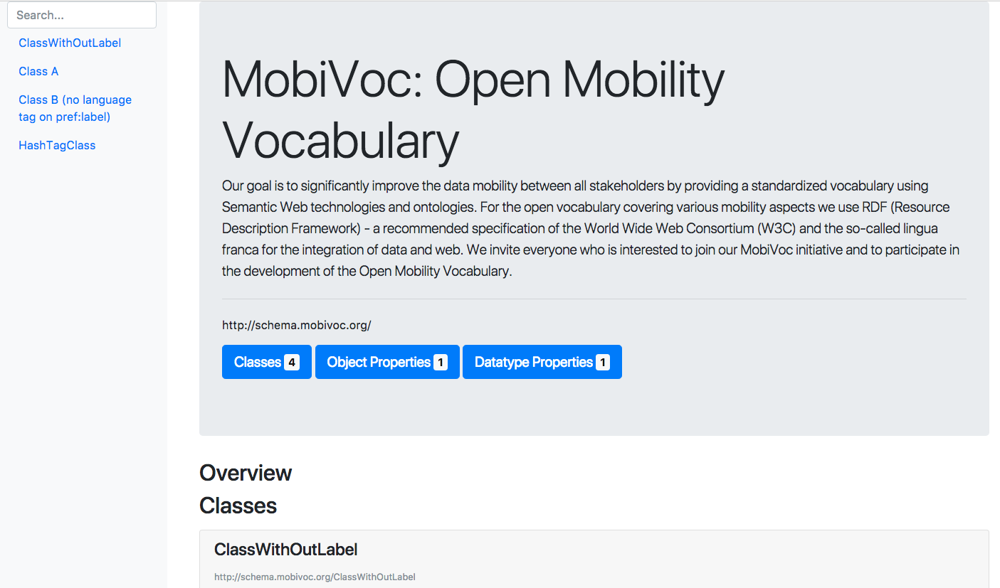

# JOD - Jekyll Ontology Documentation

The JOD project generates documentation web pages from Ontology turtle documents.

JOD is based on [jekyll](jekyllrb.com) as well as the wonderful [jekyll-rdf plugin](https://github.com/aksw/jekyll-rdf) and creates web pages which use [Bootstrap 4](https://getbootstrap.com/) as a front-end component library.

## Status

In development as a proof of concept project at [eccenca](https://www.eccenca.com).


## Installation

Add this line to your Jekyll site's `Gemfile`:

```ruby
gem "jekyll-theme-jod"
```

And add this line to your Jekyll site's `_config.yml`:

```yaml
theme: jekyll-theme-jod
```

And then execute:

    $ bundle

Or install it yourself as:

    $ gem install jekyll-theme-jod

## Usage

TODO: Write usage instructions here. Describe your available layouts, includes, and/or sass.

## Docker

There is also a docker container, that hides away all of the jekyll and jekyll-rdf specific configuration.
It currently is available at the GitHub Container Registry as `ghcr.io/eccenca/jod:main`.

As preparation your ontology should be available as `ontology.ttl` in the current directory.
Specify the base URL for the Jod documentation as `JOD_URL` (mandatory).
You can overwrite the ontologies title with `JOD_TITLE`.
The switch `JOD_RESTRICTION_URL` configures jod to only build resources with the configured base URL (this brings some speed up).
To use your own configuration you can overwrite the docker run command, e.g. `jekyll build --disable-disk-cache --config _config.yml`. Checkout the [Jekyll RDF documentation for details](https://github.com/AKSW/jekyll-rdf).

```
docker run --rm -v .:/data -e JOD_URL=http://example.org -e JOD_RESTRICTION_URL=True ghcr.io/eccenca/jod:main
```

Will produce a directory `_site` with the generated documentation.

## Contributing

Bug reports and pull requests are welcome on GitHub at https://github.com/[USERNAME]/hello. This project is intended to be a safe, welcoming space for collaboration, and contributors are expected to adhere to the [Contributor Covenant](http://contributor-covenant.org) code of conduct.

## Development

To set up your environment to develop this theme, run `bundle install`.

Your theme is setup just like a normal Jekyll site! To test your theme, run `bundle exec jekyll serve` and open your browser at `http://localhost:4000`. This starts a Jekyll server using your theme. Add pages, documents, data, etc. like normal to test your theme's contents. As you make modifications to your theme and to your content, your site will regenerate and you should see the changes in the browser after a refresh, just like normal.

When your theme is released, only the files in `_layouts`, `_includes`, and `_sass` tracked with Git will be released.

## License

The theme is available as open source under the terms of the [MIT License](https://opensource.org/licenses/MIT). Take a look at the `LICENSE` file.

## Examples and Screenshot



Examples of using jod
- [diggr Video Game Vocabulary](https://diggr.github.io/diggr-video-game-vocabulary/) ([repo](https://github.com/diggr/diggr-video-game-vocabulary))
- [GND Ontology](https://d-nb.info/standards/elementset/gnd)

## Related Projects

- [Widoco](https://github.com/dgarijo/Widoco), a Wizard for documenting ontologies
- [LODE](https://github.com/essepuntato/LODE), Live OWL Documentation Environment to convert OWL ontologies into HTML human-readable pages
- [specgen](https://github.com/zazi/specgen) and other tools from the [Generating HTML documentation of OWL](https://www.w3.org/2011/prov/wiki/Generating_HTML_documentation_of_OWL) page
- [OntoWiki's](http://ontowiki.net/) [site extension](https://github.com/AKSW/site.ontowiki), a HTML Content Publishing system on top of Linked Data
- [Ontodocs](https://github.com/lambdamusic/Ontodocs), a Python command line application aimed at facilitating the creation of documentation for ontologies encoded in RDF/OWL.
